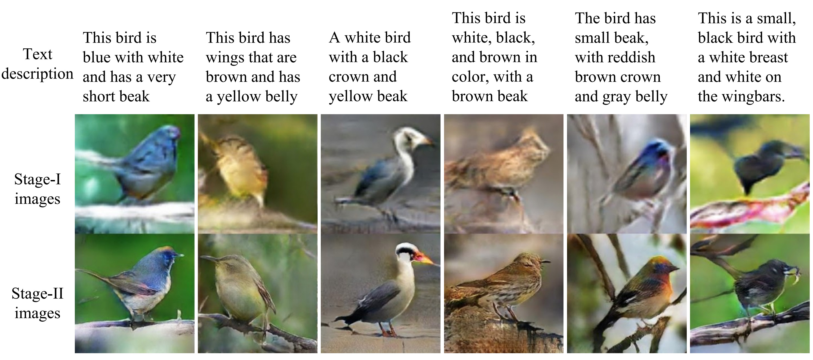
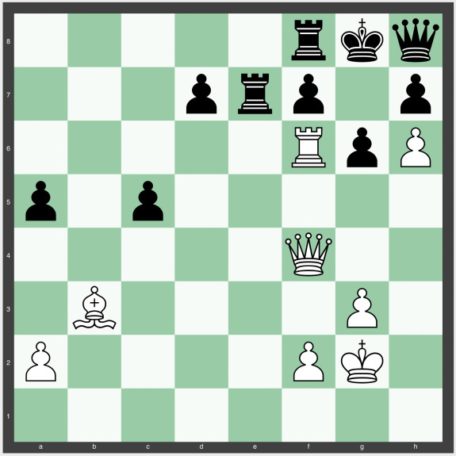

**Online üzemmód**

- Március 25-étől kezdődően az előadásokat virtuálisan tartjuk a Microsoft Teams program segítségével
- Időpont: szokásos szerda 16:00
- Helyszín: "Course 2019/20/2 deepln1x0_m17vx 1 - Mély tanulás (deep learning)" általános (general) csatornájában nyitott videóbeszélgetés
- [Link a tárgy csatornájára](https://teams.microsoft.com/l/channel/19%3ab49699eee7314b16a17311e17ff293b7%40thread.tacv2/General?groupId=d0460abd-d6f5-493a-bd90-cd4ac3930a3b&tenantId=b366dbcd-4fc3-4451-82d2-e239564302c3)
- A belépéshez caesar.elte.hu vagy student.elte.hu fiókra van szükség
- Meeting etikett
    + Kérjük, hogy mindenki hang nélkül jelentkezzen be a szobába.
    + A kérdések feltevését erősen bátorítjuk, de szeretnénk keretek között tartani. Előadás közben kérdéseket a meeting chat funkcióján keresztül lehet feltenni. Az előadó mellett lesz a szobában olyan oktató, aki a kérdéseket írásban megválaszolja, vagy szóban közvetíti az előadó felé. Emellett az előadó gyakran meg fogja adni a lehetőséget, hogy a hallgatók szabadon kérdezzenek, akár írásban, akár szóban.

**A 2020-as tavaszi félév programja**

- 2020\. 02\. 12\. [Bevezető, kedvcsináló](docs/elte-deeplearning-starter-2020.pdf)
    + Előadó: Varga Dániel

- 2020\. 02\. 19\. [Deep Learning alapfogalmak](docs/dl2020_nn_bevezeto.pdf)
    + Előadó: Zombori Zsolt
    + [1\. Házi feladat](https://colab.research.google.com/drive/10a_O1RO3OZ3i6Jj_O8w0XScYJQcyiAyf#scrollTo=Oefmx5K2WCPk): Határidő március 4.

- 2020\. 02\. 26\. [Konvolúciós hálózatok](docs/dl2020_cnn.pdf)
    + Előadó: Csiszárik Adrián
    + [2\. Házi feladat](https://colab.research.google.com/drive/1LK-KFuyAiW39O1NX0YR8cvd8x5fr6nSp#scrollTo=-Oyd2Yyk94V7): Határidő március 15.

- 2020\. 03\. 04\. [Mély hálók: Batchnorm, Resnet; Optimalizálás neurális hálózatokban](docs/dl2020_deep_nets.pdf)
    + Előadó: Csiszárik Adrián

- 2020\. 03\. 11\. Labor: Deep Learning programozási alapismeretek
    + Előadó: Zombori Zsolt
    + Laboron használt példaprogramok: [tutorial.py](lab/tutorial.py), [tutorial_regularize.py](lab/tutorial_regularize.py), [tutorial_batchnorm.py](lab/tutorial_batchnorm.py), [tutorial_conv.py](lab/tutorial_conv.py), [tutorial_siamese.py](lab/tutorial_siamese.py), [tutorial_callback.py](lab/tutorial_callback.py), [tutorial_metric.py](lab/tutorial_metric.py)
    + [3\. Házi feladat](https://colab.research.google.com/drive/1QgppKeLY_eL2JgHxy5Bl_uYfn1ucK9Ey): Határidő március 25.

- 2020\. 03\. 18\. Tavaszi szünet

- 2020\. 03\. 25\. [Generatív modellezés (Generative Adversarial Networks)](docs/dl2020_gan_links.md)
    + Előadó: Varga Dániel
    + [Link a tárgy csatornájára](https://teams.microsoft.com/l/channel/19%3ab49699eee7314b16a17311e17ff293b7%40thread.tacv2/General?groupId=d0460abd-d6f5-493a-bd90-cd4ac3930a3b&tenantId=b366dbcd-4fc3-4451-82d2-e239564302c3)    
    + [4\. Házi feladat](https://colab.research.google.com/drive/1DHIvXwm0Z1QebuMPbDdooDxrjwCICOCC): Határidő április 15.

- 2020\. 04\. 01\. [Generatív modellezés (Variational Autoencoders)](docs/dl2020_vae.pdf)
    + Előadó: Kiss Melinda
    + [További hasznos linkek](docs/dl2020_vae_links.md)
    + [Link a tárgy csatornájára](https://teams.microsoft.com/l/channel/19%3ab49699eee7314b16a17311e17ff293b7%40thread.tacv2/General?groupId=d0460abd-d6f5-493a-bd90-cd4ac3930a3b&tenantId=b366dbcd-4fc3-4451-82d2-e239564302c3)

- 2020\. 04\. 08\. [Szekvencia Modellezés](docs/DL2020_rnn.pdf)
    + Előadó: Zombori Zsolt
    + [Elolvasandó tananyag](https://www.deeplearningbook.org/contents/rnn.html)
    + További hasznos linkek:
        + [LSTM bevezető](http://colah.github.io/posts/2015-08-Understanding-LSTMs)
        + [LSTM példakód Tensorflow2-vel](https://towardsdatascience.com/multi-class-text-classification-with-lstm-using-tensorflow-2-0-d88627c10a35)
    + [Link a tárgy csatornájára](https://teams.microsoft.com/l/channel/19%3ab49699eee7314b16a17311e17ff293b7%40thread.tacv2/General?groupId=d0460abd-d6f5-493a-bd90-cd4ac3930a3b&tenantId=b366dbcd-4fc3-4451-82d2-e239564302c3)

- 2020\. 04\. 15\. [Természetes nyelv feldolgozás (NLP)](https://colab.research.google.com/drive/1cfy30mNHtAbhkvae4s3uyajbpGHz3uiL)
    + Előadó: Csanády Bálint
    + [További hasznos linkek](docs/dl2020_nlp_links.md)
    + [Link a tárgy csatornájára](https://teams.microsoft.com/l/channel/19%3ab49699eee7314b16a17311e17ff293b7%40thread.tacv2/General?groupId=d0460abd-d6f5-493a-bd90-cd4ac3930a3b&tenantId=b366dbcd-4fc3-4451-82d2-e239564302c3)
    + 5\. Házi feladat: Határidő április 29.
        + [Word2Vec](https://colab.research.google.com/drive/1LyigxaokouZw2yvKGM_EjvY1eeAePjSM) - 30%
        + [LSTM](https://colab.research.google.com/drive/1sX-pXKV_0JlQ2l4qWwBBCF_iiRa1FuZZ) - 70%
        + [GPT2](https://colab.research.google.com/drive/1m3r46sd8_rCOvTbSa-FujRVpyhuqCJUm) - szorgalmi
        
- 2020\. 04\. 22\. [Attention, Transformer, BERT](docs/dl2020_attention_links.md)
    + Előadó: Csiszárik Adrián
    + [Link a tárgy csatornájára](https://teams.microsoft.com/l/channel/19%3ab49699eee7314b16a17311e17ff293b7%40thread.tacv2/General?groupId=d0460abd-d6f5-493a-bd90-cd4ac3930a3b&tenantId=b366dbcd-4fc3-4451-82d2-e239564302c3)

- 2020\. 04\. 29\. [Megerősítéses tanulás](docs/DL2020_rl.pdf)
    + Előadó: Zombori Zsolt
    + [Link a tárgy csatornájára](https://teams.microsoft.com/l/channel/19%3ab49699eee7314b16a17311e17ff293b7%40thread.tacv2/General?groupId=d0460abd-d6f5-493a-bd90-cd4ac3930a3b&tenantId=b366dbcd-4fc3-4451-82d2-e239564302c3)
    + 6\. [Házi feladat](https://colab.research.google.com/drive/1wkXMJRDBq3a8HO4ggeS88MHr1T_1IO_M?usp=sharing): Határidő május 16.

- 2020\. 05\. 06\. [StyleGAN](https://users.renyi.hu/~daniel/stylegan-szeminarium-2020.pdf)
    + Előadó: Varga Dániel
    + [Link a tárgy csatornájára](https://teams.microsoft.com/l/channel/19%3ab49699eee7314b16a17311e17ff293b7%40thread.tacv2/General?groupId=d0460abd-d6f5-493a-bd90-cd4ac3930a3b&tenantId=b366dbcd-4fc3-4451-82d2-e239564302c3)

- 2020\. 05\. 13\. [Öntanulás (Self supervised learning)](https://lilianweng.github.io/lil-log/2019/11/10/self-supervised-learning.html)
    + Előadó: Csiszárik Adrián
    + [Link a tárgy csatornájára](https://teams.microsoft.com/l/channel/19%3ab49699eee7314b16a17311e17ff293b7%40thread.tacv2/General?groupId=d0460abd-d6f5-493a-bd90-cd4ac3930a3b&tenantId=b366dbcd-4fc3-4451-82d2-e239564302c3)

**Jegyszerzés módja**

A jegyszerzéshez a kiadott 6 házi feladatból legalább 5-öt el kell készíteni.

**Feltételezett előismeretek**

Lineáris algebrai alapismeretek, többváltozós analízis alapismeretek, python alapismeretek

A jegyszerzést megkönnyítő további előismeretek: gépi tanulás alapfogalmai, valószínűségszámítási alapismeretek, python tudományos programozás (numpy, scipy)

**Konzultáció**

Személyes konzultáció előzetes e-mail egyeztetés alapján

**Előadók:**
* Csiszárik Adrián: cs[keresztnev]@renyi.hu
* Lukács András: [vezeteknev]@cs.elte.hu
* Varga Dániel: [keresztnev]@renyi.hu
* Zombori Zsolt: [vezeteknev]@renyi.hu

* Benkő Beatrix: b[keresztnev]1010@gmail.com
* Czifra Domonkos: [keresztnev].[vezeteknev]@gmail.com
* Csanády Bálint: cs[keresztnev]@cs.elte.hu
* Kiss Melinda: [keresztnev]f[vezeteknev]@gmail.com

**Hosszútávú kutatási lehetőségek**

Az érdeklődő hallgatók számára lehetőséget biztosítunk
izgalmas kutatási projektekbe való bekapcsolódásra.

---

Alább kedvcsináló illusztrációk néhány sikeres deep learning rendszerről. Ezek, vagy egyszerűbb változataik a szemináriumon is bemutatásra kerülnek majd.

A [Mask R-CNN](https://github.com/matterport/Mask_RCNN) képszegmentáló:

---

A [StackGAN](https://github.com/hanzhanggit/StackGAN) szöveget képpé alakító rendszer:

---

Látens térbeli szemantikus képmanipuláció. Illusztráció a FaceApp-ból:

---

Az AlphaZero négy órával a sakk szabályainak megismerése után legyőzi a sakkvilágbajnok Stockfish programot. AlphaZero világossal lép:

